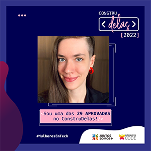

# CONSTRUDELAS 2022

O ConstruDelas é um programa de capacitação para mulheres na área de programação back-end, criado pela Juntos Somos Mais, em parceria com a WoMakersCode.

Este bootcamp possui duração de 21 semanas, sendo mais de 200 horas de capacitação técnica.

## Ementas e projetos

- [x] [Ementa Front-end](./ementa-frontend.md)

- [x] [Projeto Front-end](https://github.com/iW90/azavital)

- [x] [Ementa Back-end](./ementa-backend.md)

